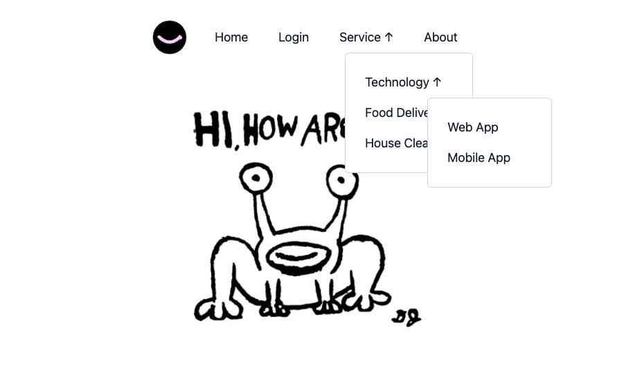
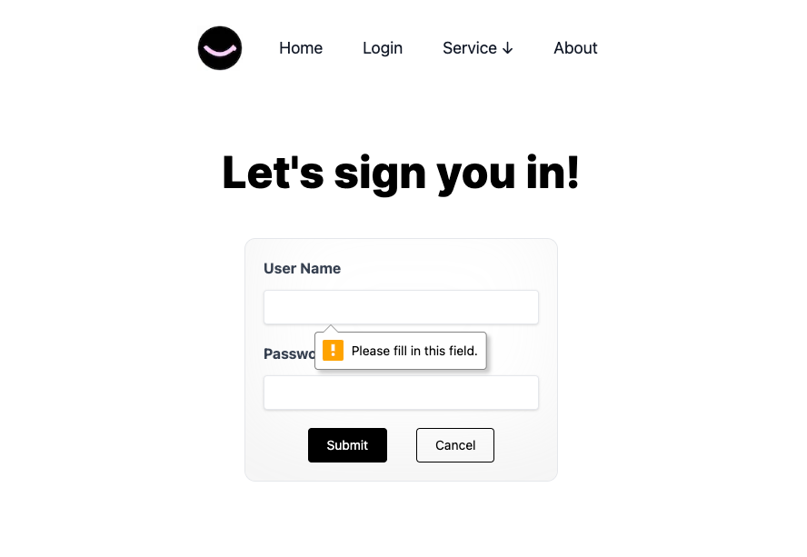

## 💃 Introduction
* Welcome to the NextJS Recursive Menu App! 🚀

* This application is crafted using NextJS with TypeScript and seamlessly integrated with Jest for efficient testing.

### Key Features:

- **BFF Pattern with Server-Side Render:** Employing a server-side fetch, this app efficiently renders a server component by fetching and processing menu JSON.

- **Dynamic and Recursive Menu Rendering:** Enjoy a multi-layered menu that dynamically and recursively renders based on the fetched JSON data.

- **Secure Login Form:** The login form is powered by React Hook Form with a Yup resolver, ensuring robust validation. The validated form data is posted to the API route.

- **Testing with Jest:** Ensure the reliability of your codebase through unit tests using Jest.

## 📱 Screenshots
### Nested Menu



### Login Form


## 🚀 How To Use

From your command line:

```bash
# Clone this repository
$ git clone https://github.com/ridiczhi/next-recursive-menu

# Go into the repository
$ cd next-recursive-menu

# Install dependencies
$ npm install
```

Scripts related to the Next.js app:

```bash

# Start the app in development mode with hot-code reloading
$ npm run dev
# Now you can run the app in dev mode via http://localhost:3000/

# To create an optimized production build, you need run dev firstly, because my api endpoints are in 'http://localhost:3000/api'
$ npm run dev
$ npm run build

# After building the app start it in production mode
$ npm start

# Run Unit Test via Jest
$ npm test
```
## 📗 Solutions

* [NextJs 14 - App Router](https://nextjs.org/docs)
* [React(Typescript)](https://react.dev/)
* [React Hook Form / Yup](https://react-hook-form.com/docs)
* [Tailwind](https://tailwindcss.com/)
* [Jest](https://github.com/testing-library/jest-dom)


## 📰 License

This project is licensed under the MIT License - see the [LICENSE.md](LICENSE.md) file for details